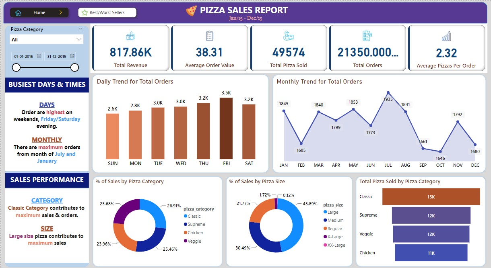
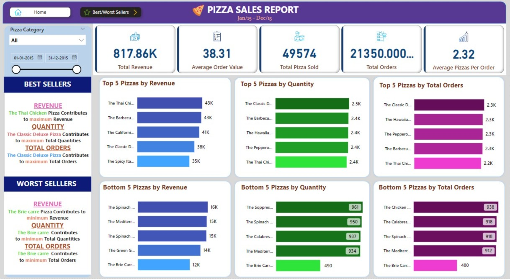

# 🍕 Pizza Sales Project - SQL & Power BI

### **Overview**
The **Pizza Sales Project** is a data analysis and visualization initiative designed to analyze and visualize sales data from a fictional pizza restaurant chain. This project leverages **SQL** for data extraction and transformation and **Power BI** for creating insightful visualizations. The ultimate goal is to provide actionable insights that can help the pizza restaurant chain **optimize operations**, **boost sales**, and **enhance customer satisfaction**.

### **Project Components**

1. **Data Acquisition**  
   The project begins with acquiring raw sales data, which may include:
   - **Customer orders**
   - **Product details**
   - **Order dates**
   - **Transaction amounts**

   Data can be sourced from various platforms, including **databases**, **CSV files**, or other data storage systems.

2. **Data Transformation with SQL**  
   **SQL (Structured Query Language)** is employed to clean, filter, and transform the raw data into an analysis-ready format. Key tasks include:
   - **Joining tables** to consolidate data
   - **Aggregating data** for summaries
   - **Handling missing values** to ensure data integrity
   - **Creating new calculated fields** for advanced analysis

3. **Data Analysis**  
   With the data prepared, in-depth analysis is conducted using SQL queries. This analysis includes:
   - **Identifying top-selling pizza flavors**
   - **Analyzing sales trends** over time
   - **Evaluating customer demographics and preferences**
   - **Calculating average order values**
   - **Assessing the performance** of individual restaurant locations

4. **Power BI Visualization**  
   **Power BI** is used to create interactive and informative visualizations that bring the analysis to life. Visualizations include:
   - **Bar charts and pie charts** showing sales by product category
   - **Time series charts** illustrating sales trends
   - **Geographic maps** displaying the distribution of restaurant locations
   - **Dashboards** summarizing key performance indicators (KPIs)

   
   *Figure 1: Pizza Sales Dashboard Overview*

   
   *Figure 2: Pizza Sales Dashboard Overview*

5. **Insights and Recommendations**  
   Based on the data analysis and visualizations, actionable insights and recommendations are provided to the pizza restaurant chain. These insights can help in making **informed decisions** to:
   - **Improve sales**
   - **Refine marketing strategies**
   - **Enhance overall business performance**

### **Dependencies**
- **SQL database** or data source
- **Power BI Desktop**
